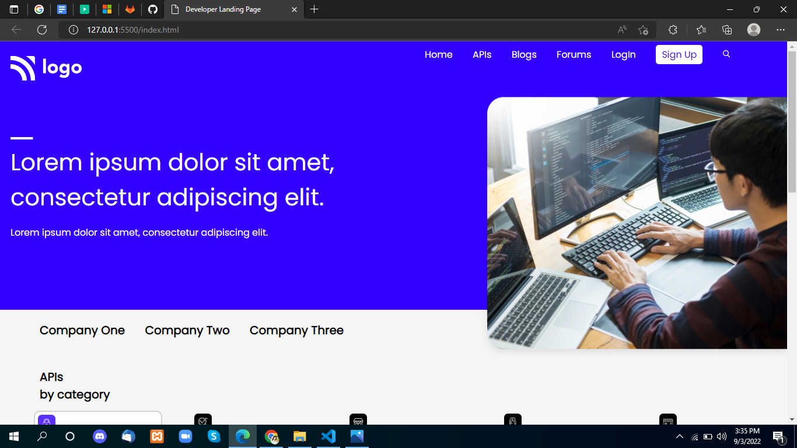
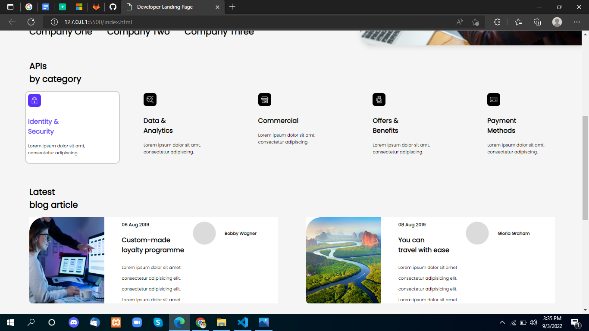
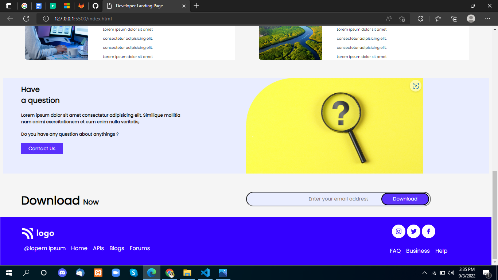

# Project-9

 

## Project live link
[https://my-project-09.netlify.app/](https://my-project-09.netlify.app/ "project09")

## Screenshot

 

## project Type
- UI Design
- One Page Website

## My learning from this Project
- Nav Bar
- Header Footer
- Grid-Template
- Flex-box

## Time to make this project
#### Approx 3 hour to make this project
